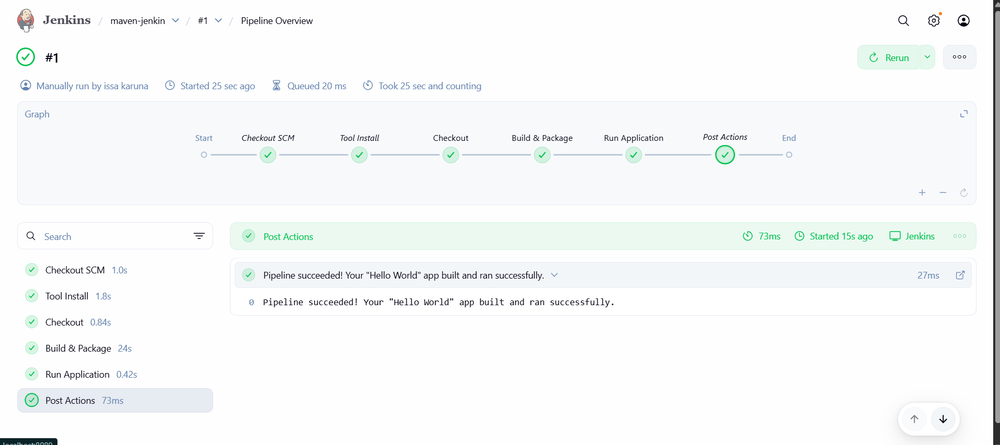

# hello-java-maven

This project contains a simple **Java HelloWorld application** built with **Maven** and automated using a **Jenkins Pipeline**.  
It demonstrates the basic CI/CD flow of compiling and packaging a Java application through Jenkins.

---

## 📌 Overview
- A simple Java application with `HelloWorld.java`.  
- `pom.xml` is used for Maven build configuration.  
- A Jenkins **Pipeline job** is created to automatically build the project.  
- The Pipeline runs `mvn clean package` and generates a JAR file.  
- Jenkins console output confirms a successful build with **`BUILD SUCCESS`**.

---

## 🛠️ Tools & Technologies
- **Java JDK** (8 or 11)  
- **Maven**  
- **Jenkins Pipeline**  
- **Git** (for version control)

---

## 🚀 Steps Performed
1. Wrote a simple Java HelloWorld application.  
2. Added a `pom.xml` file for Maven configuration.  
3. Installed and configured **JDK**, **Maven**, and **Git** in Jenkins.  
4. Created a **Pipeline job** in Jenkins.  
5. Added a declarative pipeline script to build the project with Maven.  
6. Executed the pipeline and verified **`BUILD SUCCESS`** in the Jenkins console output.  
7. Archived the generated `.jar` file as a build artifact.  

---

## 📷 Deliverable
- Screenshot of Jenkins console output showing **successful build** (`BUILD SUCCESS`).
- 
- ![jenkins output] (2.png)  

---

## ✅ Outcome
- Successfully built a Java Maven project using **Jenkins Pipeline**.  
- Completed Task 8: *Run a Simple Java Maven Build Job in Jenkins*.  

---
